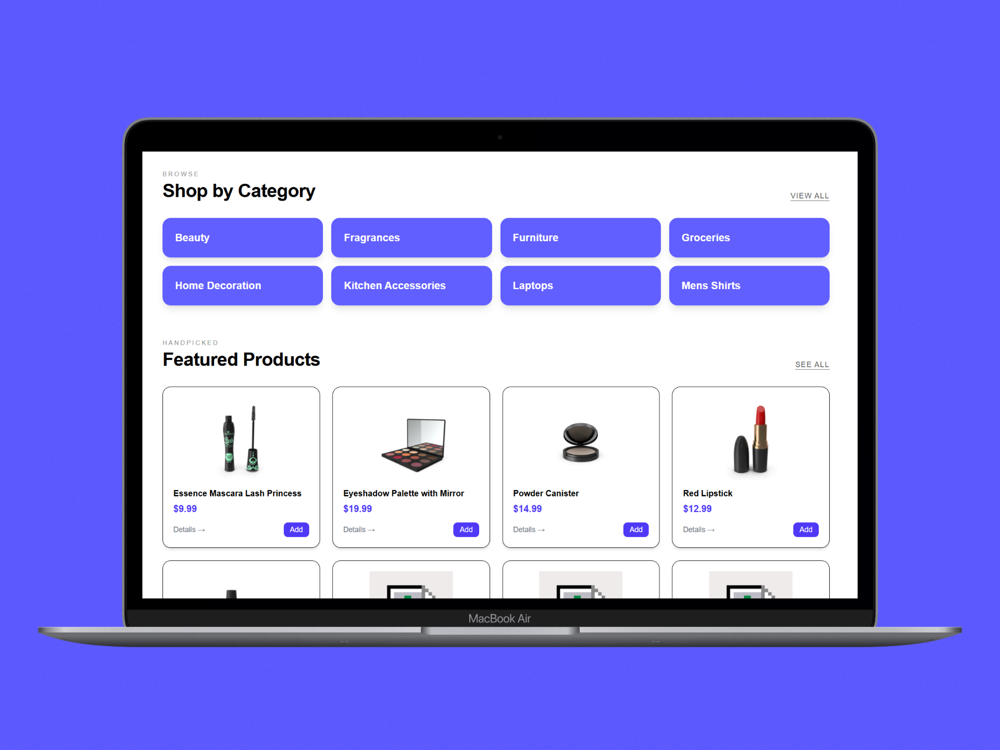
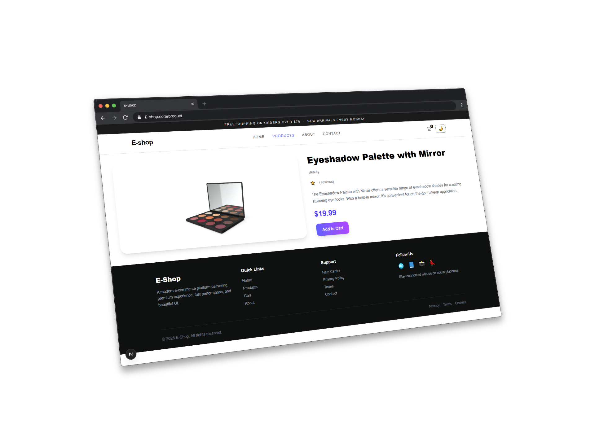
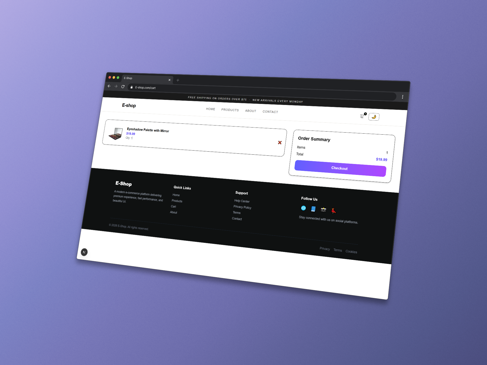
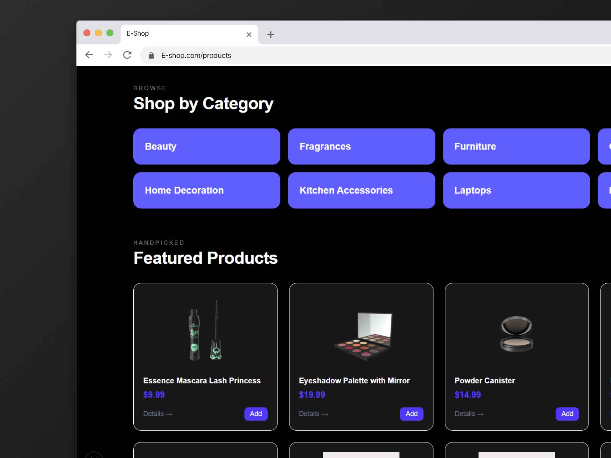

# 🛒 E-Commerce Platform — Next.js (Production-Level UI)

A high-quality, fully responsive **E-Commerce Web Application** built with **Next.js App Router** and **Tailwind CSS**, delivering a modern, fast, and scalable shopping experience inspired by real-world platforms like Amazon.

---

## 🚀 Live Demo

🔗 https://e-commerce-ahmedkhaled582s-projects.vercel.app/

---

## 📸 Preview

### 🏠 Home Page


### 📦 Products Page


### 📦 Product Details Page


### 🛒 Cart Page


### 🌙 Dark Mode


---

## ✨ Highlights

* ⚡ Blazing fast performance (Next.js App Router)
* 🎨 Premium UI/UX (Amazon-inspired layout)
* 🌙 Dark Mode with persistence
* 🛒 Fully functional cart system
* 📱 Fully responsive (mobile-first)
* 🔥 Clean architecture & scalable structure

---

## 🧩 Features Breakdown

### 🧭 Routing & Architecture

* Next.js App Router
* Nested layouts
* Dynamic routing (`/products/[id]`, `/category/[name]`)
* Error handling (`error.tsx`, `not-found.tsx`)

---

### 🛍️ Core Features

* Product listing (Fake Store API)
* Product details page
* Category filtering system
* Search functionality
* Shopping cart (Add / Remove / Total)

---

### 🎨 UI / UX

* Amazon-style homepage
* Hero sections & layered layout
* Gradient-based modern design
* Smooth hover effects
* Skeleton loading states
* Clean spacing & typography

---

### 📡 Data Handling

* Server-side data fetching
* API integration (dummyjson)
* Category-based endpoints

---

### ⚙️ Custom API Routes

* `/api/products`
* `/api/cart`

---

### 📩 Extra Sections

* About page (Landing-style design)
* Contact page (with Google Maps)
  
---

## 🧱 Tech Stack

| Technology     | Usage            |
| -------------- | ---------------- |
| Next.js 16+    | App Router & SSR |
| React          | UI Components    |
| Tailwind CSS   | Styling          |
| Framer Motion  | Animations       |
| Dummyjson      | Data             |

---

## 📁 Folder Structure

```bash
app/
  layout.tsx
  page.tsx
  products/
    page.tsx
    [id]/page.tsx
  category/
    [name]/page.tsx
  cart/
    page.tsx
  about/
    page.tsx
  contact/
    page.tsx
  api/

components/
  Navbar.tsx
  AddToCartButton.tsx
  ProductCard.tsx
  CategoryCard.tsx
  Footer.tsx

context/
  CartContext.tsx

lib/
  api.ts
```

---

## ⚡ Getting Started

### Clone the repository

```bash
git clone https://github.com/Ahmedkhaled582/E-commerce.git
```

### Install dependencies

```bash
npm install
```

### Run locally

```bash
npm run dev
```

---

## 🌙 Dark Mode

* Controlled via Tailwind `dark` class
* Stored in `localStorage`
* Fully integrated across all components

---

## 🧠 Key Learnings

* Advanced Next.js App Router usage
* Dynamic routing & server components
* State management for cart system
* Building scalable UI systems
* Real-world project structuring

---

## 🚀 Future Improvements

* 🔐 Authentication (JWT / NextAuth)
* 💳 Payment integration (Stripe)
* 📦 Order management system
* 🧾 Admin dashboard
* 🔔 Toast notifications
* 🌍 Multi-language support

---

## 👨‍💻 Author

**Ahmed Khaled**

* 🌐 Portfolio: https://ahmedkhaled582.github.io/Portfolio/
* 💼 LinkedIn: https://www.linkedin.com/in/ahmed-khaled-yahia
